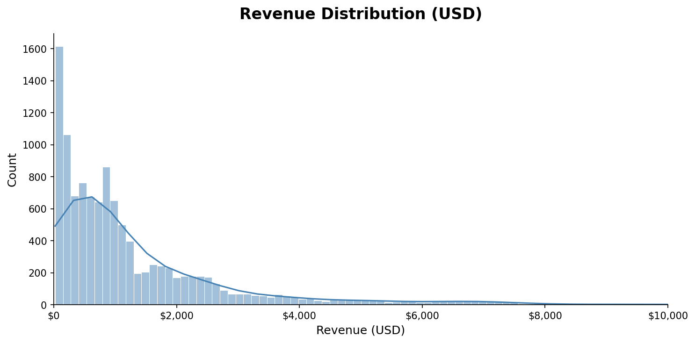
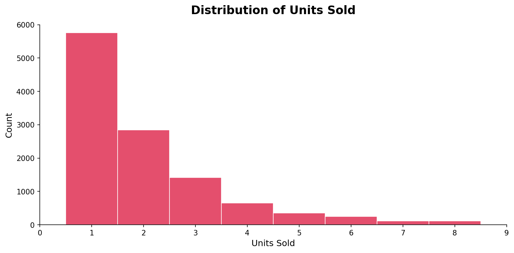
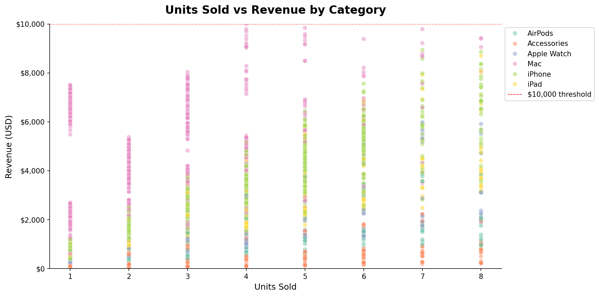

::: {.column-page}

Here are some of my key projects that demonstrate my skills in data analytics, visualization, and business analysis.

---

## [Apple Global Sales Analysis](https://github.com/t-primero/apple-sales-analysis)

**Description**: 
An end-to-end exploratory data analysis of 11,500 Apple sales transactions across 27 features, spanning 2022–2024. The project covers data cleaning, imputation, visualization, and business-driven insights across product categories, regions, sales channels, and customer segments.

**Technologies Used**:
Python, Pandas, Matplotlib, Seaborn, Jupyter Notebooks

**Key Highlights**:

- Cleaned and imputed missing data across storage, previous device OS, and customer rating columns
- Built 15+ visualizations including distribution plots, heatmaps, correlation analysis, and revenue breakdowns
- Identified that discounting does not drive volume — the 15% discount tier generates ~$427 less revenue per transaction with no compensating uplift in units sold
- Analyzed return rates, customer ratings, and revenue by region, category, and sales channel

---
## More Projects Coming Soon
Check out my [GitHub profile](https://github.com/t-primero) for the latest work.
:::